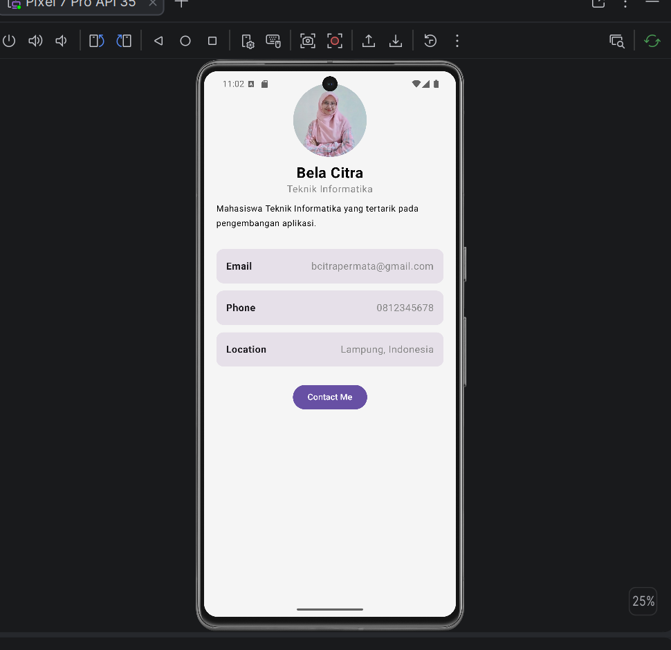

Daftar Praktikum
* Praktikum 1 → branch praktikum-1
* Praktikum 3 → My Profile App (master)

# My Profile App

## Deskripsi

My Profile App merupakan aplikasi profil sederhana yang dibuat menggunakan Kotlin dan Compose Multiplatform. Aplikasi ini menampilkan informasi profil dalam tampilan yang sederhana dan terstruktur.

## Fitur

* Menampilkan foto profil berbentuk lingkaran
* Menampilkan nama dan program studi
* Menampilkan bio singkat
* Menampilkan informasi email, nomor telepon, dan lokasi
* Tombol Contact Me
* Menggunakan reusable Composable Functions

## Composable Functions

Aplikasi menggunakan beberapa Composable Functions yang dapat digunakan kembali:

* `ProfileHeader()` — menampilkan foto profil, nama, program studi, dan bio.
* `InfoItem()` — menampilkan informasi seperti email, phone, dan location.
* `ProfileCard()` — mengatur keseluruhan tampilan halaman profil.

## Komponen UI

Komponen Compose yang digunakan dalam aplikasi:

* `Column`
* `Row`
* `Box`
* `Card`
* `Text`
* `Button`
* `Image`
* `Modifier`

## Teknologi

* Kotlin
* Compose Multiplatform
* Material 3

## Screenshot

### Tampilan Aplikasi

Screenshot aplikasi akan ditambahkan setelah aplikasi dijalankan pada Android Emulator.

## Cara Menjalankan

1. Buka project menggunakan Android Studio.
2. Tunggu hingga proses Gradle selesai.
3. Jalankan aplikasi menggunakan Android Emulator.
4. Pilih perangkat Pixel yang tersedia.
5. Aplikasi akan menampilkan halaman My Profile.

## Praktikum

**Mata Kuliah:** Pengembangan Aplikasi Mobile
**Pertemuan:** 3 — Compose Multiplatform Basics
**Topik:** Layouts, UI Components, dan Modifiers
